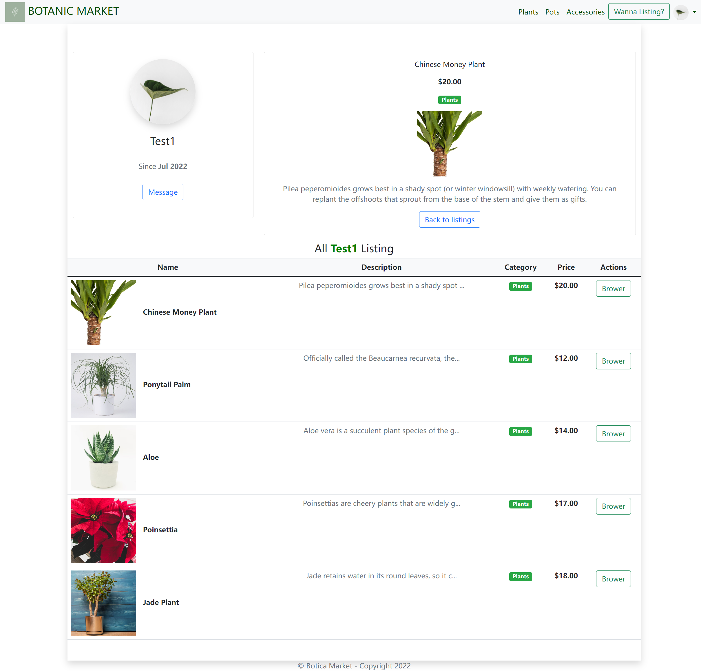
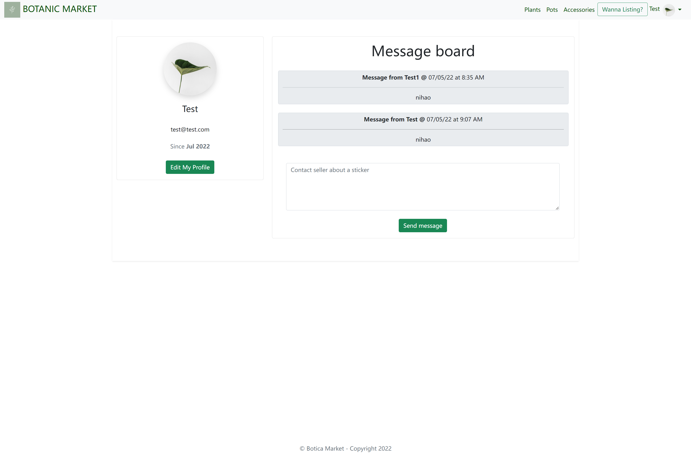
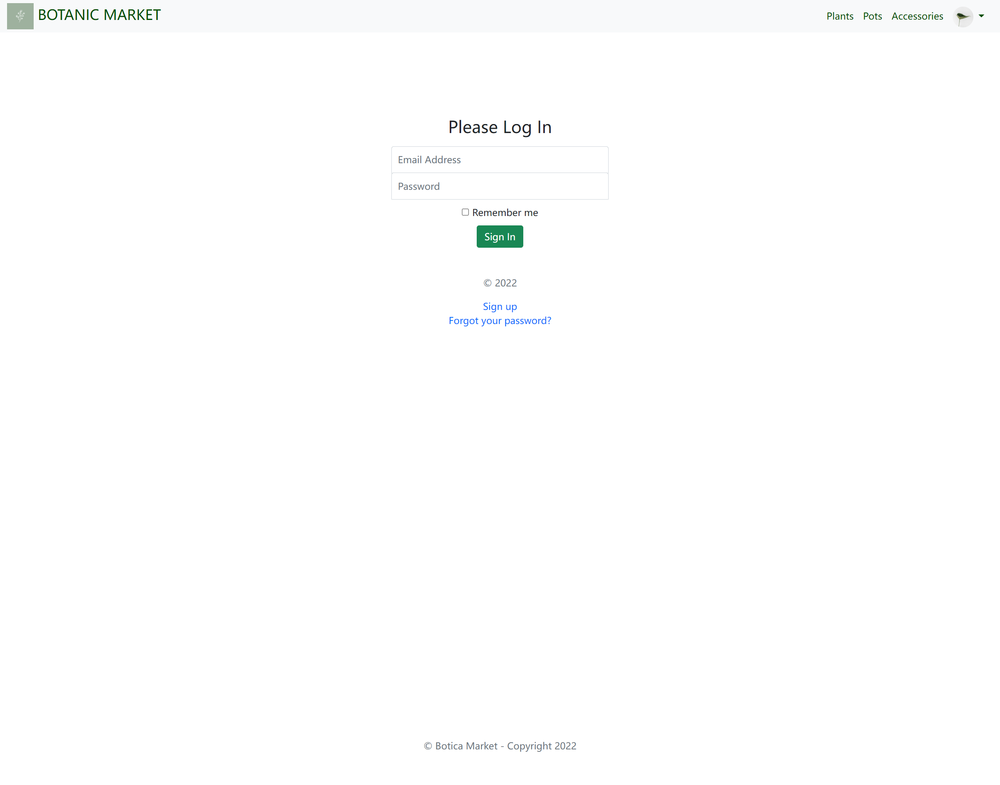
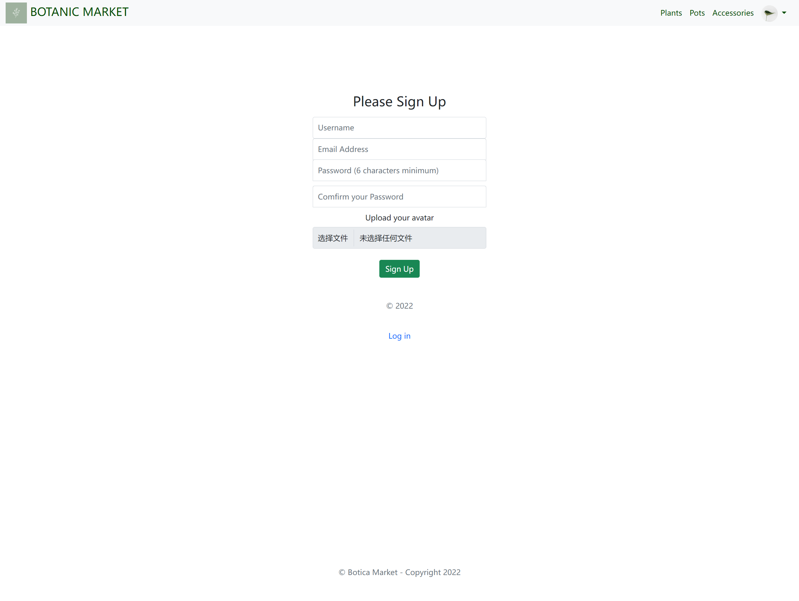
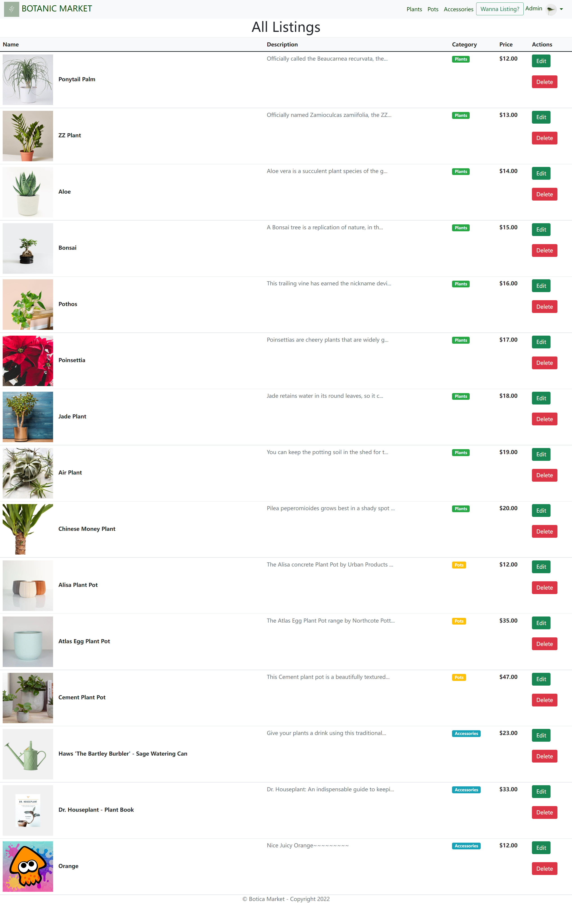

## Botanic Merket - T2A2
-------------------
#### by Chen Zhang
-------------------

### R9	A link (URL) to your deployed app:
Heroku: https://botanicmarket.herokuapp.com/
<br>
### R10	A link to your GitHub repository:
GitHub: https://github.com/OrangeKami/Chen_Zhang_T2A2
<br>
## R7 R8 Problem overview:
The problem I am trying to solve is to create a marketplace platform to buy and sell  plants and assossicatd product.

This is the problem that beacuse of the Covid padanmic, more and more extreme weathers and also the inflation, makes 
online shopping is priority choice for people's buying instead of traditional local market(Sunday Market, Bunnings and etc.)

Evaryone loves greens at home, especially when you have to spend most of daytime at home or in office. A little green plant is the key to help you relief and relax. This marketplace app I have build, allow user to buy and sell their own plants product and insite message to sellers just like local store. 


## R11	Description of your marketplace app:

### Purpose:
This two-sided marketplace web application allows signed in users to post up plants items that they would like to sell, and also be able to purchase listings from other user. A registered and signed in user should be able to quickly create a listing without great difficulty, that should include basic details of the listing item, and also upload an image. Insite message system to help users communicate easier and detail.
### Functionality and features:
|Functionality | Description|
|---|---|
| Accounts | Users are able to create new accounts when signing up, and must be logged in to create new listings of listing items, or purchase listings. All users can view items without having to sign up or log in, however if they click on an item, they will need to sign in to view the individual listing and see the options to message the seller or add the listing to watchlist. A user can change/update their profile at any time and has its own avatar.
| listings | Once a user has logged in, they are able to create a new  listing by inserting the required information about the listing, and uploading an image is optional. If they do not upload an image, a default image will be added on.  Listings can be updated or edited but only by the person that created the listing and that person must be logged in to see the edit or delete options of the listing. Once a user has logged out, they will still see all listings. |
| Messages | Buyers and sellers can message each other regarding a listing, and their messages are shown along with the time and name of the person sending the message.  |
| Watchlist or shopping cart | A user who has logged in can place an item in their whatchlist. They can update the list.|
| Search | Anyone can search for an item without having to log in first. The search bar is shown on every page of the app, and allows users to enter keywords which will search through the title and description of listings. |
| Admin| Admin account can access listing items to edit and delet them. And also can see all the users in the market and choose to delete them or not. |


### Sitemap:

For different Users


### Screenshot:
index page


listing page


listing detail page


message page


singin/signup page



admin page

### Target audience:

The target audience are for anyone with a working smartphone, tablet, desktop devices with connection to the internet. Users don't need to have a credit card for purchasing, as they may want to contact the seller via e-mail or insite message system to arrange alternative payments and exchange of the goods. As this app is also targetted towards audience with intention to purchase locally, hopefully travelling shouldn't too much of a hassle. Alternatively, the seller and buyer may arrange for items to be delivered if they are unable to get out. For example, stuck in isolation or bad weather.

### Tech Stack:
* Front end: HTML5, CSS, SCSS, BOOTSTRAP, Javascript
* Back end: Ruby 2.7.5, Ruby on Rails 7.0.3
* Database: PostgreSQL
* Deployment: Heroku
* Project Management: Trello Board
* DevOps: Git, GitHub, VS Code, Webpacker, Bundle, Yarn and Balsamiq
<br>
## R12	User stories for your app:
As a user when you singed in, you can buy and sell plants items on market. we will discuuse this into two parts:

***As a Seller***

* I do not want anyone else to edit or delete my listings.
* I want to log in with my email and password to edit or delete my listings.
* I want to log in first before seeing messages that have been sent to me.
* if I receive a message, I want to also see the time stamp of when the message was sent and who it was from.
* I want to be able to create more than 1 account on the application.
* I want to update my details on my profile.
* I want to delete my account at any time.
* if someone wants to buy my listing or message me, then they should have a user profile with the app.
* I do not want others to access my account or change my profile information.

***As a Buyer***

* I want to see listings without having to sign up or sign in.
* I want to see an image of the listing, its name, description, category and price.
* I want to send a message to the seller about a particular listing.
* I only want my messages to a seller to be shown to that seller and not be made public.
* I want to be able to add item to a whtchlist/shopping cart.
* I want to be able to delete items from the watchlist/shopping cart.
* I do not want others to access my account or change my profile information.

***As a Admin***
* I want to see a table of all users and can delete them when needed.
* I want to see a table of all listings and can edit them and delete them without any permision.

## R13	Wireframes for your app:
 
 
 
 
 
 

## R14	An ERD for your app:
.png)

## R15	Explain the different high-level components (abstractions) in your app:

Botanic Market is a two sided marketplace application that allows the users to buy and sell their plants and its associated items.

A rails applications uses both the Model View Controller (MVC) architecture as well as using convention over configuration principles.

* Controllers (ActionController) acting as a connection between the model, view and receiving information from the web server via the routing table.

* Views (Actionview) are the front-end of the application, the display information to the web server for display to the user's browser using HTML.

Bootstrap - is a simplified and easy way to use CSS. It does so by providing templates and simplified in line styling by writing classes.

* Models (Activerecord) are responsible for the data and logic contained in the database, including validation and manipulation (including retrieving, adding, editing or updating and destroying them).

The database is handled by PostgreSQL,an open source Relational Database Management System. It allows the application to store and process data in table form.


## R16	Detail any third party services that your app will use:

* minimagick (lets users transform images that they're uploading
* font-awesome-sass - adds font-awesome, which is used to create icons throughout the app, such as the shopping cart icon, magnifying glasses icon, heart icon and others
* heroku - a container-based cloud Platofrm as a PaaS service which allows the application to be deployed, hosted and managed on their server.
* Bootstrap - to make styling process more efficient and to improve the responsiveness of my website I used the Bootstrap gem for CSS styling.
* Amazon S3 Web Services for image hosting
* Devise - The application uses the gem Devise to authenticate users. Unregistered users can only view the index and product listing page, and will be prompted to sign in or register to view any other content. Devise enables this functionality without requiring a sign in or registration method to be defined.

## R17	Describe your projects models in terms of the relationships (active record associations) they have with each other:
* Users and Listings
  * user has many listings 
  * listings belongs to a User
* Conversations and messages
  * conversation has many messages 
  * message belongs to conversation
  * User has many coversations
  * conversation belongs to User
  * User has many messages
  * message belongs to user

Watchlist are included in Listing model but not in the table
Use sessions to store watchlist, session can be stored by cookies or active record(locally).
* watchlist
  * watchlist belongs to User
  * watchlist has many listings

Iamges: photo in listings table and avatar in Users table 
* listing has one photo attached
* User has one avatar attached

#### validations
Most of validations are in User and Listing model
User Moder
```
validates :avatar, file_size: { less_than_or_equal_to: 5.megabytes },
              file_content_type: { allow: ['image/jpeg', 'image/png', 'image/gif'] }
validates :email, uniqueness: true 
validates :username, uniqueness: { case_sensitive: false }
```

Listing Model
```
validates :name, :description, :price, presence: true
    
validates :photo, file_size: { less_than_or_equal_to: 5.megabytes },
              file_content_type: { allow: ['image/jpeg', 'image/png', 'image/gif'] }
validates :price, :numericality => {:greater_than => 0}, :format => { :with => /\A\d+(?:\.\d{0,2})?\z/ }, length: {maximum: 6}
validates :description, length: { maximum: 1000, too_long: "Description must be less than %{count} characters."}
validates :name, length: {maximum: 200, too_long: "Title must be less than %{count} characters." }
```

## R18 Discuss the database relations to be implemented in your application:

* The user_id primary key is used as a foreign key in the Conversation, Message, Watchlist and Listing model.
* In active_storage_attachments and active_storage_variant_records table, they have column blob_id, and it is foreign key, but in active_storage_blobs table, it is primary key.
* A conversation can have many optional Messages, but if there is a Message, it must belong to a Conversation, which is why it references the conversation_id as a foreign key. A message also refers to the user_id as a foreign key.
* A listing references the user_id as a foreign key because the app needs to know who created each listing, for authorisation purposes. A user may have many optional listings, or choose to have none. But if a listing exists, then it must reference the user_id so that its author is identified.

## R19	Provide your database schema design:

```create_table "action_text_rich_texts", force: :cascade do |t|
    t.string "name", null: false
    t.text "body"
    t.string "record_type", null: false
    t.bigint "record_id", null: false
    t.datetime "created_at", null: false
    t.datetime "updated_at", null: false
    t.index ["record_type", "record_id", "name"], name: "index_action_text_rich_texts_uniqueness", unique: true
  end

  create_table "active_storage_attachments", force: :cascade do |t|
    t.string "name", null: false
    t.string "record_type", null: false
    t.bigint "record_id", null: false
    t.bigint "blob_id", null: false
    t.datetime "created_at", null: false
    t.index ["blob_id"], name: "index_active_storage_attachments_on_blob_id"
    t.index ["record_type", "record_id", "name", "blob_id"], name: "index_active_storage_attachments_uniqueness", unique: true
  end

  create_table "active_storage_blobs", force: :cascade do |t|
    t.string "key", null: false
    t.string "filename", null: false
    t.string "content_type"
    t.text "metadata"
    t.string "service_name", null: false
    t.bigint "byte_size", null: false
    t.string "checksum"
    t.datetime "created_at", null: false
    t.index ["key"], name: "index_active_storage_blobs_on_key", unique: true
  end

  create_table "active_storage_variant_records", force: :cascade do |t|
    t.bigint "blob_id", null: false
    t.string "variation_digest", null: false
    t.index ["blob_id", "variation_digest"], name: "index_active_storage_variant_records_uniqueness", unique: true
  end

  create_table "conversations", force: :cascade do |t|
    t.integer "sender_id"
    t.integer "recipient_id"
    t.datetime "created_at", null: false
    t.datetime "updated_at", null: false
    t.index ["sender_id", "recipient_id"], name: "index_conversations_on_sender_id_and_recipient_id", unique: true
  end

  create_table "listings", force: :cascade do |t|
    t.string "name"
    t.decimal "price"
    t.string "image"
    t.text "description"
    t.string "category"
    t.datetime "created_at", null: false
    t.datetime "updated_at", null: false
    t.bigint "user_id", null: false
    t.index ["user_id"], name: "index_listings_on_user_id"
  end

  create_table "messages", force: :cascade do |t|
    t.text "body"
    t.bigint "conversation_id"
    t.bigint "user_id"
    t.boolean "read", default: false
    t.datetime "created_at", null: false
    t.datetime "updated_at", null: false
    t.index ["conversation_id"], name: "index_messages_on_conversation_id"
    t.index ["user_id"], name: "index_messages_on_user_id"
  end

  create_table "pg_search_documents", force: :cascade do |t|
    t.text "content"
    t.string "searchable_type"
    t.bigint "searchable_id"
    t.datetime "created_at", null: false
    t.datetime "updated_at", null: false
    t.index ["searchable_type", "searchable_id"], name: "index_pg_search_documents_on_searchable"
  end

  create_table "users", force: :cascade do |t|
    t.string "username", default: "", null: false
    t.string "email", default: "", null: false
    t.string "encrypted_password", default: "", null: false
    t.string "reset_password_token"
    t.datetime "reset_password_sent_at"
    t.datetime "remember_created_at"
    t.integer "sign_in_count", default: 0, null: false
    t.datetime "current_sign_in_at"
    t.datetime "last_sign_in_at"
    t.string "current_sign_in_ip"
    t.string "last_sign_in_ip"
    t.string "confirmation_token"
    t.datetime "confirmed_at"
    t.datetime "confirmation_sent_at"
    t.string "unconfirmed_email"
    t.datetime "created_at", null: false
    t.datetime "updated_at", null: false
    t.boolean "admin", default: false
    t.index ["email"], name: "index_users_on_email", unique: true
    t.index ["reset_password_token"], name: "index_users_on_reset_password_token", unique: true
  end

  create_table "watchlists", force: :cascade do |t|
    t.datetime "created_at", null: false
    t.datetime "updated_at", null: false
  end

  add_foreign_key "active_storage_attachments", "active_storage_blobs", column: "blob_id"
  add_foreign_key "active_storage_variant_records", "active_storage_blobs", column: "blob_id"
  add_foreign_key "listings", "users"
end
```

## R20	Describe the way tasks are allocated and tracked in your project:
Tasks, problems and progress check are managed by Trello. 

Branching in Git was used where a new feature was created in a separate branch before being merged only once it was functioning and deleted after merge.

Trello: <https://trello.com/b/hftnxtjt/marketplace-app>

 

.png)